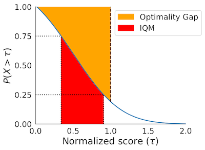
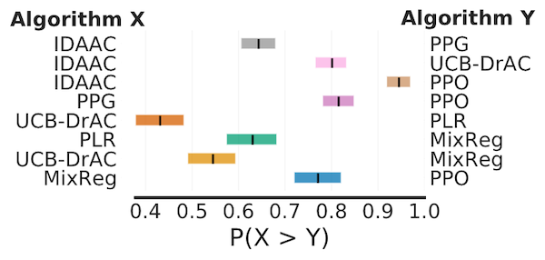
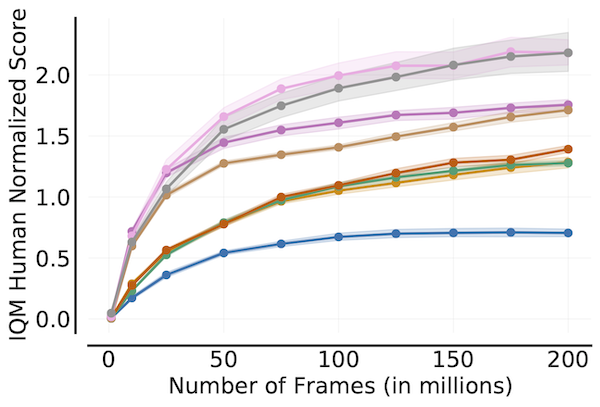

## `rliable`

`rliable` is an open-source Python library for reliable evaluation, even with a *handful
of runs*, on reinforcement learning and machine learnings benchmarks. `rliable`
provides support for:

 * Stratified Bootstrap Confidence Intervals (CIs)
 * Performance Profiles (with plotting functions)
 * Aggregate metrics
   * Interquartile Mean (IQM) across all runs
   * Optimality Gap
   * Probability of Improvement




To install rliable as a package, run:

```python
pip install git+https://github.com/google-research/rliable
```

To import `rliable`, we suggest:

```python
from rliable import library as rly
from rliable import metrics
from rliable import plot_utils
```

### Aggregate metrics with 95% Stratified Bootstrap CIs


##### IQM, Optimality Gap, Median, Mean
```python
algorithms = ['DQN (Nature)', 'DQN (Adam)', 'C51', 'REM', 'Rainbow',
              'IQN', 'M-IQN', 'DreamerV2']
# Load ALE scores as a dictionary mapping algorithms to their human normalized
# score matrices, each of which is of size `(num_runs x num_games)`.
atari_200m_normalized_score_dict = ...
aggregate_func = lambda x: np.array([
  metrics.median(x),
  metrics.aggregate_iqm(x),
  metrics.aggregate_mean(x),
  metrics.aggregate_optimality_gap(x)])
aggregate_scores, aggregate_score_cis = rly.get_interval_estimates(
  atari_200m_normalized_score_dict, aggregate_func, reps=50000)
fig, axes = plot_utils.plot_aggregate_metrics(
  aggregate_scores, aggregate_score_cis,
  metric_names=['Median', 'IQM', 'Mean', 'Optimality Gap'],
  algorithms=algorithms, xlabel='Human Normalized Score')
```


##### Probability of Improvement
```python
# Load ProcGen scores as a dictionary containing pairs of normalized score
# matrices for pairs of algorithms we want to compare
procgen_algorithm_pairs = {.. , 'x,y': (score_x, score_y), ..}
average_probabilities, average_prob_cis = rly.get_interval_estimates(
  procgen_algorithm_pairs, metrics.probability_of_improvement, reps=50000)
plot_probability_of_improvement(average_probabilities, average_prob_cis)
```



#### Sample Efficiency Curve
```python
algorithms = ['DQN (Nature)', 'DQN (Adam)', 'C51', 'REM', 'Rainbow',
              'IQN', 'M-IQN', 'DreamerV2']
# Load ALE scores as a dictionary mapping algorithms to their human normalized
# score matrices across all 200 million frames, each of which is of size
# `(num_runs x num_games x 200)` where scores are recorded every million frame.
ale_all_frames_scores_dict = ...
frames = np.array([1, 10, 25, 50, 75, 100, 125, 150, 175, 200]) - 1
ale_frames_scores_dict = {algorithm: score[:, :, frames] for algorithm, score
                          in ale_all_frames_scores_dict.items()}
iqm = lambda scores: np.array([metrics.aggregate_iqm(scores[..., frame])
                               for frame in range(scores.shape[-1])])
iqm_scores, iqm_cis = rly.get_interval_estimates(
  ale_frames_scores_dict, iqm, reps=50000)
plot_utils.plot_sample_efficiency_curve(
    frames+1, iqm_scores, iqm_cis, algorithms=algorithms,
    xlabel=r'Number of Frames (in millions)',
    ylabel='IQM Human Normalized Score')
```



### Performance Profiles

```python
# Load ALE scores as a dictionary mapping algorithms to their human normalized
# score matrices, each of which is of size `(num_runs x num_games)`.
atari_200m_normalized_score_dict = ...
# Human normalized score thresholds
atari_200m_thresholds = np.linspace(0.0, 8.0, 81)
score_distributions, score_distributions_cis = rly.create_performance_profile(
    atari_200m_normalized_score_dict, atari_200m_thresholds)
# Plot score distributions
fig, ax = plt.subplots(ncols=1, figsize=(7, 5))
plot_utils.plot_performance_profiles(
  perf_prof_atari_200m, atari_200m_tau,
  performance_profile_cis=perf_prof_atari_200m_cis,
  colors=dict(zip(algorithms, sns.color_palette('colorblind'))),
  xlabel=r'Human Normalized Score $(\tau)$',
  ax=ax)
```


The above profile can also be plotted with non-linear scaling as follows:
```python
plot_utils.plot_performance_profiles(
  perf_prof_atari_200m, atari_200m_tau,
  performance_profile_cis=perf_prof_atari_200m_cis,
  use_non_linear_scaling=True,
  xticks = [0.0, 0.5, 1.0, 2.0, 4.0, 8.0]
  colors=dict(zip(algorithms, sns.color_palette('colorblind'))),
  xlabel=r'Human Normalized Score $(\tau)$',
  ax=ax)
```


### Dependencies
The code was tested under `Python>=3.7` and uses these packages:

- arch
- scipy
- numpy
- absl-py

Citing
------
If you find this open source release useful, please reference in your paper:

    @inproceedings{agarwal2021precipice,
      title={Deep Reinforcement Learning at the Edge of the Statistical Precipice},
      author={Agarwal, Rishabh and Schwarzer, Max and Castro, Pablo Samuel and
              Courville, Aaron and Bellemare, Marc G.},
      year={2021},
    }

Disclaimer: This is not an official Google product.
